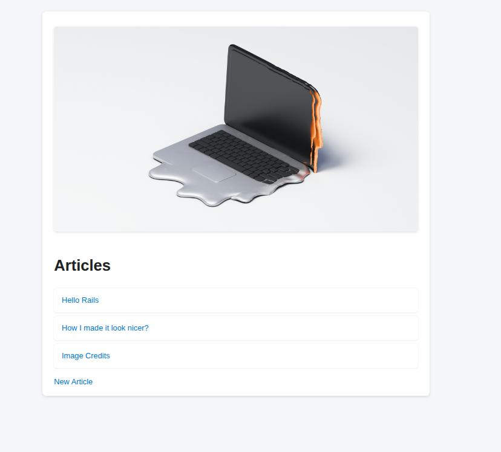
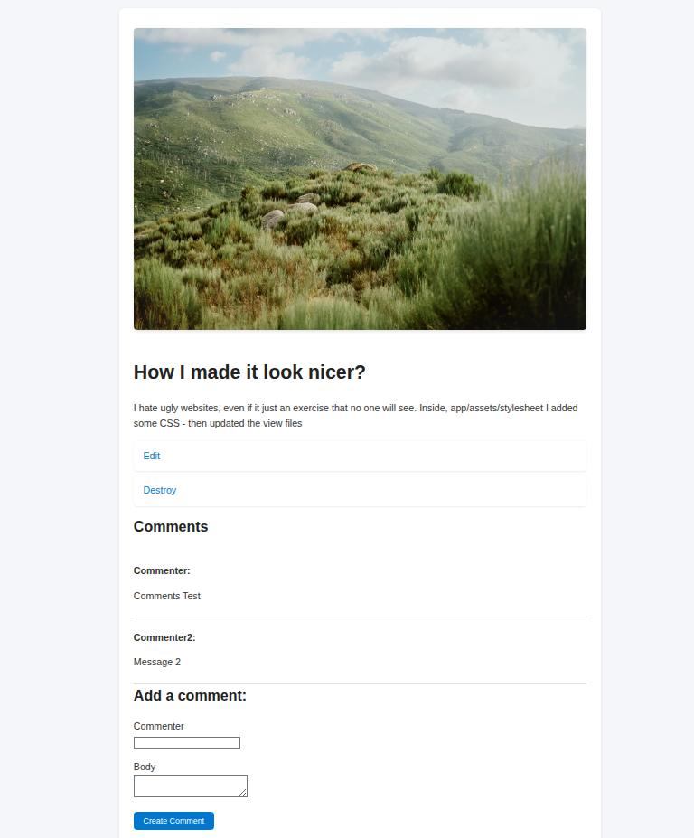

# Blog App

This is a simple blog application built by following the [Getting Started with Rails](https://guides.rubyonrails.org/v7.2/getting_started.html) tutorial.  
I added some extra CSS styling and images to make it look nicer.

## Screenshots

### New Article

### Articles Index

### Show Article

